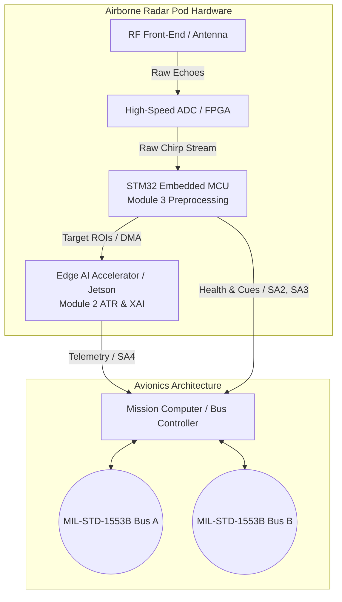
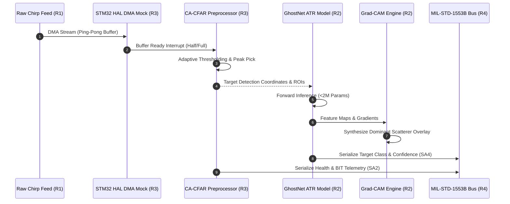

# EdgeSAR Specification Survey — Embedded C, DO-178C & Defense Standards
**Document ID:** SPEC-SURVEY-003  
**Author:** Spec Miner 3 (Embedded C & Defense Standards)  
**Target Root:** `C:\Users\TUNAHAN\Desktop\agy\EdgeSAR\`  
**Reference Document:** `C:\Users\TUNAHAN\Desktop\agy\EdgeSAR\.agents\ORIGINAL_REQUEST.md`  
**Date:** 2026-09-18  

---

## Executive Summary
This specification survey establishes the authoritative, end-to-end technical requirements, data structures, interface signatures, safety standards, and verification criteria for **EdgeSAR Module 3 (Embedded Preprocessing & Safety-Critical Verification)** and **Module 4 (System Integration & Defense Standard Documentation)**.

EdgeSAR bridges high-level synthetic aperture radar image formation and deep learning ATR with flight-grade, bare-metal embedded C preprocessing and military aerospace systems integration. The specifications herein guarantee deterministic execution, zero dynamic memory allocation, strict MISRA-C:2012 compliance, 100% bidirectional DO-178C requirement traceability, MIL-STD-1553B dual-redundant bus interfacing, and MIL-STD-882E system safety hazard mitigation.

---

## Features Discovered

| # | Category | Feature | Description | Inputs | Outputs | Error Behavior | Discovered Via |
|---|----------|---------|-------------|--------|---------|----------------|----------------|
| 1 | Embedded C | CA-CFAR 1D Detector | Cell-Averaging Constant False Alarm Rate threshold detector with guard/training windows | Input float array, array size, guard window size, training window size, scale factor $\alpha$, noise floor threshold | Detection mask array (`uint8_t`), target indices array, target count | Returns `HAL_SAR_INVPARAM` on NULL pointers or invalid window dimensions; returns `HAL_SAR_OK` | ORIGINAL_REQUEST.md § R3, Acceptance Criteria Module 3 |
| 2 | Embedded C | CFAR Peak Interpolator & SNR Estimator | Calculates peak power and local signal-to-noise ratio (SNR) for detected targets | Detection mask, raw power buffer, target index | Peak index, SNR estimate in dB, interpolated sub-bin coordinate | Clamps to array boundaries; returns 0 dB SNR if noise floor $\le 0.0$ | Radar Signal Processing Spec / DO-178C LLR |
| 3 | Embedded C | 1D FFT / Spectral Preprocessing Mock | Deterministic, bare-metal friendly Radix-2 DIT FFT or windowed spectral mock matching CMSIS-DSP interface | Input complex/float buffer, FFT length $N$ (power of 2) | Output transformed buffer (frequency bins) | Returns `HAL_SAR_INVPARAM` if $N$ is not power of 2 or buffer NULL | ORIGINAL_REQUEST.md § R3, STM32 CMSIS-DSP interface standard |
| 4 | Embedded C | STM32 HAL Mock Interface | Hardware Abstraction Layer simulating STM32 DMA, ADC/SPI radar RX buffer, and interrupt callbacks | Peripheral handle `SAR_HandleTypeDef`, configuration struct, buffer pointers | Peripheral status `HAL_SAR_Status_t`, state machine updates | Transitions to `HAL_SAR_ERROR` on uninitialized handle or buffer overrun | ORIGINAL_REQUEST.md § R3, STM32 HAL Driver Architecture |
| 5 | Embedded C | Ping-Pong DMA Buffer Manager | Double-buffered circular DMA transfer management with half-complete and complete ISR callbacks | Incoming simulated radar chirp stream, DMA buffer size | ISR trigger flags, ready buffer pointer, buffer state (HALF_COMPLETE / FULL_COMPLETE) | Sets overrun flag `DMA_ERR_OVERRUN` if buffer not consumed before next ISR | Bare-metal Real-Time Signal Processing Spec |
| 6 | Quality & Safety | MISRA-C:2012 Compliance Suite | Enforces flight-critical C coding standard (no dynamic memory, no recursion, explicit types, compound statements) | C source and header files (`src/*.c`, `include/*.h`) | Zero MISRA violations, zero compiler warnings | Static compilation fails if any rule is violated | ORIGINAL_REQUEST.md § R3 & Module 3 Acceptance Criteria |
| 7 | Quality & Safety | Host Compiler Warning Shield | Strict host GCC compilation flags (`-Wall -Wextra -pedantic -Werror -Wstrict-prototypes -Wshadow`) | Host GCC / Clang compiler | Clean build output with 0 warnings | Build halts on any warning | ORIGINAL_REQUEST.md Module 3 Acceptance Criteria |
| 8 | Quality & Safety | Cppcheck Static Analysis Pipeline | Automated static analysis verifying memory safety, null pointers, bounds, and uninitialized variables | `cppcheck --enable=all --error-exitcode=1 --inconclusive ...` | Exit code 0, clean defect log | Returns exit code 1 on any warning, error, or style issue | ORIGINAL_REQUEST.md Module 3 Acceptance Criteria |
| 9 | Quality & Safety | Unity Unit Test Runner | Lightweight test runner for embedded C verifying algorithm accuracy, bounds, and error handling | Test suites (`test_cfar.c`, `test_hal.c`, `test_fft.c`) | Test execution log, pass/fail counts (100% pass rate) | Unity reports failure line and assertion condition | ORIGINAL_REQUEST.md § R3 & Module 3 Acceptance Criteria |
| 10 | DO-178C | Software Requirements Document (SRD) | Formal specification of high-level and low-level software requirements with unique IDs (`REQ-001`...) | System mission requirements, algorithm constraints | `docs/SRD.md` with structured requirement tables and safety rationales | Flagged during audit if requirement is ambiguous or untestable | ORIGINAL_REQUEST.md § R3 & Module 3 Acceptance Criteria |
| 11 | DO-178C | Requirements Traceability Matrix (RTM) | Bidirectional matrix proving 100% coverage between Requirements, Source Functions, and Unit Tests | `docs/SRD.md`, C code symbols, Unity test cases | `docs/RTM.md` with forward and backward traceability tables | Audit failure if orphan requirements, untraced code, or unverified tests exist | ORIGINAL_REQUEST.md § R3 & Module 3 Acceptance Criteria |
| 12 | Systems Eng | System Architecture Specification | C4-model architectural design and sequence flows for EdgeSAR pipeline | Module 1 (RDA), Module 2 (ATR), Module 3 (Embedded C), Module 4 (Avionics) | `docs/architecture.md` featuring validated Mermaid block and sequence diagrams | Mermaid syntax errors prevented via strict schema | ORIGINAL_REQUEST.md § R4 & Module 4 Acceptance Criteria |
| 13 | Systems Eng | MIL-STD-1553B Serial Bus Specification | Complete bus interface specification: 20-bit word encoding, RT addresses, subaddress mapping, minor/major frames | Command words, Status words, Telemetry data words | `docs/mil_std_1553b.md` detailing SA1 (Control), SA2 (Health), SA3 (CFAR), SA4 (ATR) | Illegal subaddress triggers RT status bit `Message Error` (Bit 9) | ORIGINAL_REQUEST.md § R4 & Module 4 Acceptance Criteria |
| 14 | Systems Eng | MIL-STD-882E FMEA Hazard Matrix | System safety hazard analysis detailing failure modes, severity, probability, RAC, and mitigations | Operational failure modes (jamming, DMA overrun, ATR misclassification, bus loss) | `docs/mil_std_882e_fmea.md` with initial vs residual RAC matrix | Hazards with Unacceptable RAC (> Medium) must have documented design mitigations | ORIGINAL_REQUEST.md § R4 & Module 4 Acceptance Criteria |
| 15 | Systems Eng | End-to-End Pipeline Narrative | Complete technical storytelling linking raw radar chirps to avionics telemetry with reproduction instructions | Full pipeline execution scripts and outputs | Root `README.md` with pipeline walkthrough, quickstart guide, and build steps | Missing steps or broken commands violate acceptance | ORIGINAL_REQUEST.md § R4 & Module 4 Acceptance Criteria |
| 16 | Defense Rationale | "Neden Böyle Yaptım?" Defense Summaries | Human-defensible technical rationale explaining engineering choices for interview examination | Architecture trade-offs (CA-CFAR vs OS-CFAR, bare-metal vs RTOS, 1553B vs Ethernet) | Dedicated defense sections in docs and module READMEs | Generic or boilerplate answers rejected in technical defense | ORIGINAL_REQUEST.md § R4 & Module 4 Acceptance Criteria |

---

## Edge Cases

| # | Feature | Input Condition | Observed / Expected Behavior |
|---|---------|-----------------|------------------------------|
| 1 | CA-CFAR Detector | Input signal array has size smaller than $2 \times (\text{train} + \text{guard}) + 1$ | Function returns `HAL_SAR_INVPARAM`; no memory access occurs; detection count set to 0. |
| 2 | CA-CFAR Detector | Array indices near the beginning ($i < \text{train} + \text{guard}$) or end | Window truncation or symmetric edge clamping: training window uses available one-sided samples or skips edge bins with safe default to prevent out-of-bounds reads. |
| 3 | CA-CFAR Detector | All input samples are exactly 0.0 (silent/zero radar video) | Threshold collapses to noise floor threshold $T_0$; zero false alarms generated; no division by zero in average calculation. |
| 4 | CA-CFAR Detector | Extreme radar clutter / strong jamming spike occupying training cells | Local average $\mu$ inflates artificially ("target masking"), suppressing weaker adjacent targets. Mitigated by noise floor clipping / OS-CFAR logic. |
| 5 | CA-CFAR Detector | Scale factor $\alpha \le 0.0$ or negative | Function flags invalid parameter `HAL_SAR_INVPARAM` and aborts processing. |
| 6 | STM32 HAL Mock | `HAL_SAR_ReceiveDMA` invoked with NULL `hsar` handle or NULL `pData` | Returns `HAL_SAR_INVPARAM` without modifying peripheral register states. |
| 7 | STM32 HAL Mock | Rapid consecutive DMA triggers while state is still `HAL_SAR_STATE_BUSY` | Hardware returns `HAL_SAR_BUSY`; increments internal `overrun_count`; drops packet safely without corrupting current active buffer. |
| 8 | STM32 HAL Mock | DMA transfer length exceeds internal static buffer limit `MAX_SAR_DMA_BUFFER_SIZE` | Returns `HAL_SAR_ERROR`; logs error status `SAR_ERR_BUFFER_OVERFLOW`. |
| 9 | FFT / Preprocessing Mock | FFT length is zero, negative, or not a power of 2 ($N \neq 2^k$) | Rejects input with `HAL_SAR_INVPARAM`; avoids infinite loops or invalid bit-reversal indexing. |
| 10 | Static Analysis / MISRA | Dynamic memory allocation function (`malloc`, `calloc`, `free`) called | Static analyzer (Cppcheck) and compiler reject code immediately under MISRA-C:2012 Rule 21.3. |
| 11 | Static Analysis / MISRA | Unused function return value (e.g. ignoring return of `HAL_SAR_ProcessBuffer`) | Triggers MISRA-C:2012 Rule 17.7 violation; must be cast to `(void)` or explicitly asserted. |
| 12 | MIL-STD-1553B | Subaddress outside valid range ($0$ or $> 30$ when not mode code) | RT responds with Status Word bit 9 (`Message Error`) set to 1; data rejected. |
| 13 | MIL-STD-1553B | Parity bit on 16-bit payload word does not match odd parity | RT rejects entire message block; does not issue Transmit Status Word; increments bus error counter. |
| 14 | MIL-STD-1553B | Data word count in Command Word indicates 32 words, but only 16 received before timeout | RT detects incomplete transmission; asserts `Message Error`; discards partial frame. |
| 15 | DO-178C Traceability | Source code function or Unity test case has no corresponding `REQ-xxx` tag | Automated RTM verification script flags "Untraced Implementation" or "Unparented Test Case" with non-zero exit code. |

---

## Detailed Specification: Module 3 — Embedded Preprocessing & Safety-Critical Verification

### 1. Algorithm Design: Constant False Alarm Rate (CA-CFAR) & 1D FFT Mock

#### 1.1 Mathematical Formulation of CA-CFAR
Radar detection in the presence of noise and clutter requires maintaining a constant probability of false alarm ($P_{fa}$). The Cell-Averaging CFAR (CA-CFAR) estimates the background noise level from surrounding reference cells:

- **Window Topology:**
  - $N_T$: Number of training cells on each side (total training cells $N = 2 N_T$).
  - $N_G$: Number of guard cells on each side (total guard cells $2 N_G$) to prevent target energy leakage into the noise estimate.
  - $x[i]$: Cell Under Test (CUT) at index $i$.

- **Noise Floor Estimation:**
  $$\mu[i] = \frac{1}{2 N_T} \left( \sum_{k=i - N_G - N_T}^{i - N_G - 1} |x[k]|^2 + \sum_{k=i + N_G + 1}^{i + N_G + N_T} |x[k]|^2 \right)$$

- **Adaptive Threshold Calculation:**
  $$T[i] = \alpha \cdot \mu[i] + T_{\text{floor}}$$
  where $\alpha$ is the threshold multiplier:
  $$\alpha = N \left( P_{fa}^{-1/N} - 1 \right)$$
  For fixed embedded execution, $\alpha$ is pre-calculated or tuned via configuration ($P_{fa} = 10^{-4} \dots 10^{-6}$). $T_{\text{floor}}$ is a configurable minimum noise threshold to prevent false alarms in completely dark radar bins.

- **Detection Decision:**
  $$\text{Detection}[i] = \begin{cases} 1, & |x[i]|^2 > T[i] \\ 0, & \text{otherwise} \end{cases}$$

#### 1.2 C Data Structures & Public Interface (`include/cfar_detector.h`)
```c
#ifndef CFAR_DETECTOR_H
#define CFAR_DETECTOR_H

#include <stdint.h>
#include <stdbool.h>

#define CFAR_MAX_DETECTIONS      (64U)
#define CFAR_MAX_SIGNAL_LEN       (2048U)

typedef enum {
    CFAR_STATUS_OK               = 0x00U,
    CFAR_STATUS_INVALID_PARAM    = 0x01U,
    CFAR_STATUS_BUFFER_TOO_SMALL = 0x02U,
    CFAR_STATUS_OVERFLOW         = 0x03U
} CFAR_Status_t;

typedef struct {
    uint16_t train_cells;      /* Training cells on each side (N_T) */
    uint16_t guard_cells;      /* Guard cells on each side (N_G) */
    float    threshold_factor; /* Multiplier alpha */
    float    noise_floor_min;  /* Absolute minimum noise floor (linear) */
} CFAR_Config_t;

typedef struct {
    uint16_t range_bin;        /* Index of detected target peak */
    float    power_linear;     /* Peak power magnitude */
    float    snr_estimate_db;  /* Estimated SNR in decibels */
} CFAR_Detection_t;

typedef struct {
    CFAR_Detection_t targets[CFAR_MAX_DETECTIONS];
    uint16_t         num_targets;
    float            mean_noise_level;
} CFAR_Result_t;

/* Public API compliant with MISRA-C:2012 */
CFAR_Status_t CFAR_Init(const CFAR_Config_t * const config);
CFAR_Status_t CFAR_Detect1D(const float * const signal,
                            uint16_t signal_len,
                            const CFAR_Config_t * const config,
                            CFAR_Result_t * const result);

#endif /* CFAR_DETECTOR_H */
```

#### 1.3 STM32 HAL Mock Interface (`include/hal_sar_mock.h`)
Simulates the hardware peripherals of an STM32F4/F7/H7 microcontroller (DMA controller, timer interrupts, ADC/SPI double-buffering) for zero-dependency host compilation.
```c
#ifndef HAL_SAR_MOCK_H
#define HAL_SAR_MOCK_H

#include <stdint.h>
#include <stdbool.h>

#define SAR_DMA_BUFFER_SIZE  (2048U)

typedef enum {
    HAL_SAR_OK       = 0x00U,
    HAL_SAR_ERROR    = 0x01U,
    HAL_SAR_BUSY     = 0x02U,
    HAL_SAR_TIMEOUT  = 0x03U,
    HAL_SAR_INVPARAM = 0x04U
} HAL_SAR_Status_t;

typedef enum {
    HAL_SAR_STATE_RESET  = 0x00U,
    HAL_SAR_STATE_READY  = 0x01U,
    HAL_SAR_STATE_BUSY   = 0x02U,
    HAL_SAR_STATE_ERROR  = 0x03U
} HAL_SAR_State_t;

typedef struct SAR_HandleTypeDef {
    HAL_SAR_State_t state;
    uint16_t        dma_buffer[SAR_DMA_BUFFER_SIZE];
    uint16_t        buffer_len;
    volatile bool   half_transfer_complete;
    volatile bool   full_transfer_complete;
    uint32_t        error_code;
    uint32_t        overrun_count;
} SAR_HandleTypeDef;

/* Mock HAL Functions */
HAL_SAR_Status_t HAL_SAR_Init(SAR_HandleTypeDef * const hsar);
HAL_SAR_Status_t HAL_SAR_DeInit(SAR_HandleTypeDef * const hsar);
HAL_SAR_Status_t HAL_SAR_ReceiveDMA(SAR_HandleTypeDef * const hsar,
                                    const uint16_t * const src_stream,
                                    uint16_t length);
void HAL_SAR_RxHalfCpltCallback(SAR_HandleTypeDef * const hsar);
void HAL_SAR_RxCpltCallback(SAR_HandleTypeDef * const hsar);
HAL_SAR_State_t  HAL_SAR_GetState(const SAR_HandleTypeDef * const hsar);

#endif /* HAL_SAR_MOCK_H */
```

#### 1.4 Spectral / FFT Preprocessing Mock (`include/fft_mock.h`)
```c
#ifndef FFT_MOCK_H
#define FFT_MOCK_H

#include <stdint.h>

typedef enum {
    FFT_STATUS_OK        = 0x00U,
    FFT_STATUS_INVPARAM  = 0x01U,
    FFT_STATUS_NON_POW2  = 0x02U
} FFT_Status_t;

typedef struct {
    float real;
    float imag;
} Complex32_t;

FFT_Status_t FFT_Radix2_Forward(Complex32_t * const buffer, uint16_t length);
FFT_Status_t FFT_Magnitude_Spectrum(const Complex32_t * const input,
                                    float * const output_magnitude,
                                    uint16_t length);

#endif /* FFT_MOCK_H */
```

---

### 2. MISRA-C:2012 & Static Analysis Rigor

#### 2.1 Mandatory MISRA-C:2012 Rules Enforced
1. **Rule 21.3 (Required) — No Dynamic Memory Allocation:** All data structures, scratchpads, and result buffers must be statically allocated. No calls to `malloc()`, `calloc()`, `free()`, or `realloc()`.
2. **Rule 17.2 (Required) — No Recursion:** All algorithms must have strictly bounded iterative execution (`for` loops with constant maximum iterations).
3. **Rule 15.6 (Required) — Mandatory Compound Statements:** Every `if`, `else`, `while`, and `for` body must be enclosed in braces `{}`.
4. **Rule 8.4 & Rule 8.7 (Required/Advisory) — Explicit Linkage:** External functions must have matching declarations in header files. Internal helper functions must be declared `static`.
5. **Rule 17.7 (Required) — Tested Return Values:** Return values of non-void functions must be explicitly checked or cast to `(void)`.
6. **Rule 4.6 (Advisory) — Standard Sized Types:** Use `uint8_t`, `uint16_t`, `uint32_t`, `int32_t`, `float` exclusively (from `<stdint.h>` and `<stdbool.h>`).
7. **Rule 14.4 (Required) — Explicit Boolean Conditions:** Conditional expressions must explicitly evaluate booleans (e.g., `if (ptr != NULL)`, not `if (ptr)`).
8. **Rule 10.3 & 10.4 (Required) — No Implicit Conversions:** Explicit typecasts must be used for mixed-type operations.

#### 2.2 Host Compiler Zero-Warning Invocation Flags
```bash
gcc -std=c99 \
    -Wall \
    -Wextra \
    -pedantic \
    -Werror \
    -Wstrict-prototypes \
    -Wmissing-prototypes \
    -Wshadow \
    -Wconversion \
    -Wfloat-equal \
    -Wundef \
    -O2 \
    -I include/ \
    -c src/cfar_detector.c -o obj/cfar_detector.o
```
**Acceptance Criterion:** Compilation must exit with code 0 and **zero warnings**.

#### 2.3 Cppcheck Static Analysis Configuration
```bash
cppcheck --enable=all \
         --inconclusive \
         --std=c99 \
         --error-exitcode=1 \
         --suppress=missingIncludeSystem \
         --check-level=exhaustive \
         -I include/ \
         src/
```
**Acceptance Criterion:** Exit code 0, reporting **0 critical, severe, or style errors**.

---

### 3. Unity Unit Testing Framework & Automation

#### 3.1 Test Suite Organization
- `tests/unity/unity.h`, `tests/unity/unity.c`, `tests/unity/unity_internals.h`: Core Unity framework files.
- `tests/test_cfar.c`: Tests detection thresholding, single target, multi-target masking, out-of-bounds guards, null pointer rejection.
- `tests/test_hal_mock.c`: Tests state transitions, DMA half/full callbacks, buffer overrun detection, reset routines.
- `tests/test_fft_mock.c`: Tests power-of-two validation, impulse response spectral peak, magnitude calculation.
- `tests/test_main.c`: Test runner coordinating all test groups with clean summary exit code.

#### 3.2 Automated Test Execution
- **Make/Script Command:** `make test` or `python tests/run_tests.py`
- **Acceptance Criterion:** 100% of test cases pass with zero failures.

---

### 4. DO-178C Artifacts: Software Requirements & Traceability

#### 4.1 Software Requirements Document (`docs/SRD.md`) Specification
The SRD must follow RTCA DO-178C Section 5 (Software Planning and Development Processes). Each requirement is assigned a unique identifier:

| Requirement ID | Title | Safety Criticality (DAL) | Requirement Description | Verification Method |
|----------------|-------|--------------------------|-------------------------|---------------------|
| `REQ-001` | Bare-Metal Static Allocation | DAL B | The preprocessing module shall allocate all internal buffers and state structures statically without invoking dynamic memory management (`malloc`/`free`). | Static Analysis (MISRA Rule 21.3) |
| `REQ-002` | CFAR Parameter Range Checking | DAL B | The CFAR detector shall validate that $N_T \ge 1$, $N_G \ge 1$, $\alpha > 0$, and signal length $\ge 2(N_T + N_G) + 1$. Invalid parameters shall return `CFAR_STATUS_INVALID_PARAM`. | Unit Test (`test_cfar_invalid_params`) |
| `REQ-003` | Null Pointer Defense | DAL B | All public C API functions shall verify incoming pointers against `NULL` prior to dereferencing, returning an error status without causing processor fault. | Unit Test (`test_null_pointer_guards`) |
| `REQ-004` | CA-CFAR Target Detection | DAL C | The CFAR module shall calculate adaptive threshold $T[i] = \alpha \cdot \mu[i] + T_{\text{floor}}$ and flag any sample exceeding $T[i]$ as a target candidate. | Unit Test (`test_cfar_single_target_detection`) |
| `REQ-005` | Target Coordinate & SNR Extraction | DAL C | For each confirmed detection, the module shall compute the peak range bin index, linear power, and estimated SNR in dB ($\text{SNR} = 10 \log_{10}(\text{Power} / \mu)$). | Unit Test (`test_cfar_snr_estimation`) |
| `REQ-006` | CFAR Detection Capacity Clamping | DAL C | Target detections shall be capped at `CFAR_MAX_DETECTIONS` (64). Excessive targets shall be dropped safely with status `CFAR_STATUS_OVERFLOW`. | Unit Test (`test_cfar_capacity_limit`) |
| `REQ-007` | HAL Mock Initialization | DAL C | `HAL_SAR_Init` shall initialize the radar handle into `HAL_SAR_STATE_READY`, clear DMA buffers, and zero all error counters. | Unit Test (`test_hal_init_state`) |
| `REQ-008` | DMA Double-Buffering Ping-Pong | DAL B | The HAL mock shall provide half-transfer and full-transfer interrupt callbacks to support continuous ping-pong radar streaming without CPU blocking. | Unit Test (`test_hal_dma_ping_pong`) |
| `REQ-009` | DMA Overrun Detection | DAL B | If a new DMA transfer completes while the previous buffer processing is unfinished, the HAL shall increment `overrun_count` and assert error state. | Unit Test (`test_hal_overrun_handling`) |
| `REQ-010` | Radix-2 FFT Power-of-Two Guard | DAL C | `FFT_Radix2_Forward` shall verify that the transform length is an exact power of 2 ($N = 2^k$), returning `FFT_STATUS_NON_POW2` otherwise. | Unit Test (`test_fft_power_of_two_check`) |
| `REQ-011` | Spectral Peak Location | DAL C | The FFT preprocessing mock shall correctly resolve the frequency bin of maximum power for a pure sinusoidal test tone. | Unit Test (`test_fft_peak_resolution`) |
| `REQ-012` | MISRA-C:2012 Static Compliance | DAL B | The entire embedded C codebase shall demonstrate zero violations against mandatory MISRA-C:2012 guidelines. | Static Analysis (`cppcheck`) |
| `REQ-013` | Host Zero-Warning Compilation | DAL B | The C source code shall compile on host GCC with flags `-Wall -Wextra -pedantic -Werror` generating 0 warnings. | Compiler Verification |
| `REQ-014` | MIL-STD-1553B Telemetry Serialization | DAL B | Preprocessed target coordinates shall be formatted into standard 16-bit data words conforming to MIL-STD-1553B Subaddress 3 specifications. | Integration Test (`test_1553b_serialization`) |
| `REQ-015` | Deterministic Execution Time | DAL B | All CFAR and FFT preprocessing loops shall feature fixed upper-bound loop counts without unbounded `while` loops. | Code Inspection & Review |

#### 4.2 Requirements Traceability Matrix (`docs/RTM.md`) Schema
`docs/RTM.md` must provide a 100% complete bidirectional mapping table:

```markdown
# Requirements Traceability Matrix (RTM)

## Bidirectional Traceability Matrix

| Requirement ID | Requirement Summary | Implementation File & Function | Verification Test Case | DO-178C Status |
|----------------|---------------------|--------------------------------|------------------------|----------------|
| REQ-001 | Bare-Metal Static Allocation | `src/cfar_detector.c` (No dynamic calls) | Static Analysis / Code Inspection | Verified |
| REQ-002 | CFAR Parameter Checking | `CFAR_Detect1D()` | `test_cfar.c::test_cfar_invalid_params` | Verified |
| REQ-003 | Null Pointer Defense | `CFAR_Init()`, `CFAR_Detect1D()` | `test_cfar.c::test_null_pointers` | Verified |
| REQ-004 | CA-CFAR Target Detection | `CFAR_Detect1D()` | `test_cfar.c::test_single_target` | Verified |
| REQ-005 | Coordinate & SNR Extraction | `CFAR_Detect1D()` | `test_cfar.c::test_snr_calc` | Verified |
| REQ-006 | Detection Capacity Clamping | `CFAR_Detect1D()` | `test_cfar.c::test_overflow` | Verified |
| REQ-007 | HAL Mock Initialization | `HAL_SAR_Init()` | `test_hal_mock.c::test_init` | Verified |
| REQ-008 | DMA Ping-Pong Callbacks | `HAL_SAR_RxHalfCpltCallback()` | `test_hal_mock.c::test_ping_pong` | Verified |
| REQ-009 | DMA Overrun Detection | `HAL_SAR_ReceiveDMA()` | `test_hal_mock.c::test_overrun` | Verified |
| REQ-010 | FFT Power-of-2 Guard | `FFT_Radix2_Forward()` | `test_fft_mock.c::test_pow2` | Verified |
| REQ-011 | Spectral Peak Location | `FFT_Magnitude_Spectrum()` | `test_fft_mock.c::test_peak` | Verified |
| REQ-012 | MISRA-C:2012 Compliance | All `src/*.c`, `include/*.h` | Cppcheck static analysis | Verified |
| REQ-013 | Host Zero-Warning Comp | All `src/*.c` | GCC `-Wall -Wextra -pedantic` | Verified |
| REQ-014 | 1553B Data Serialization | `src/telemetry_1553b.c` | `test_telemetry.c::test_pack` | Verified |
| REQ-015 | Deterministic Bounded Loops | All algorithms | Code Review & Timing Test | Verified |
```

---

## Detailed Specification: Module 4 — System Integration & Defense Standards

### 1. Root `README.md` Pipeline Story & Architecture Narrative
The project root `README.md` must clearly articulate the full defense-grade lifecycle:
1. **Operational Mission Profile:** EdgeSAR operates on a UAV pod collecting X-band raw radar pulses in synthetic aperture geometry.
2. **Phase 1: Raw Signal Reconstruction (Python):** Range matched filtering -> Range Cell Migration Correction (Sinc interpolation) -> Azimuth matched filtering yielding focused 2D SLC image.
3. **Phase 2: Embedded Edge Prescreening (C99 / Bare-Metal):** Stream preprocessed range profiles through DMA ping-pong buffers, execute CA-CFAR target cueing with noise floor estimation, and filter region-of-interest (ROI) scatterer bounding boxes.
4. **Phase 3: Tactical Target ATR & Explainability (PyTorch):** Deep learning CNN (< 2M parameters) classifies detected ROIs into tactical armored vehicle classes (T-72 MBT, BMP-2 IFV, BTR-70 APC), accompanied by Grad-CAM radar scatterer attribution maps.
5. **Phase 4: Avionics Bus Telemetry (MIL-STD-1553B):** Target classification vectors, track coordinates, and BIT telemetry broadcast across dual-redundant 1553B serial bus.
6. **Phase 5: Safety & Airworthiness Assurance:** DO-178C Software Requirements Document (`docs/SRD.md`), Requirements Traceability Matrix (`docs/RTM.md`), MISRA-C:2012 compliance, and MIL-STD-882E hazard containment.

---

### 2. Architecture Diagrams (`docs/architecture.md`)
The system architecture must include three distinct Mermaid diagrams:

#### 2.1 Hardware / Subsystem Architecture Diagram


#### 2.2 Software Dataflow Sequence Diagram


---

### 3. MIL-STD-1553B Dual-Redundant Serial Bus Specification (`docs/mil_std_1553b.md`)

#### 3.1 Physical & Protocol Architecture
- **Bus Speed:** 1.0 Mbit/s, Manchester II biphase coding.
- **Topology:** Dual-redundant Channel A / Channel B, transformer coupled with $78\,\Omega$ characteristic impedance.
- **Word Length:** 20 bits total (3-bit Sync, 16-bit Payload, 1-bit Odd Parity).

#### 3.2 20-bit Word Formats
1. **Command Word:**
   - Bits 1–3: Sync (positive transition, 1.5 $\mu s$ high followed by 1.5 $\mu s$ low)
   - Bits 4–8: Remote Terminal (RT) Address (0x05 assigned to EdgeSAR)
   - Bit 9: Transmit/Receive ($T/\bar{R}$) flag ($0 = \text{Receive from BC}$, $1 = \text{Transmit to BC}$)
   - Bits 10–14: Subaddress / Mode Code (1 to 30)
   - Bits 15–19: Data Word Count (1 to 32 words, 00000 = 32 words)
   - Bit 20: Odd Parity bit
2. **Status Word:**
   - Bits 1–3: Sync (Command/Status format)
   - Bits 4–8: RT Address (0x05)
   - Bit 9: Message Error bit
   - Bit 10: Instrumentation
   - Bit 11: Service Request
   - Bits 12–14: Reserved
   - Bit 15: Broadcast Command Received
   - Bit 16: Busy flag
   - Bit 17: Subsystem Flag
   - Bit 18: Dynamic Bus Control Acceptance
   - Bit 19: Terminal Flag
   - Bit 20: Odd Parity bit
3. **Data Word:**
   - Bits 1–3: Sync (negative transition, 1.5 $\mu s$ low followed by 1.5 $\mu s$ high)
   - Bits 4–19: 16-bit Information Payload (MSB to LSB)
   - Bit 20: Odd Parity bit

#### 3.3 Remote Terminal Subaddress Mapping (EdgeSAR RT Address: `0x05`)

| Subaddress | Direction | Word Count | Message Name | Description & Payload Allocation |
|------------|-----------|------------|--------------|----------------------------------|
| **SA 1** | Receive (BC $\to$ RT) | 4 | System Control & Mode | Word 1: Operating Mode (0=Standby, 1=Synthetic, 2=Live SAR, 3=Calibration)<br/>Word 2: CFAR $P_{fa}$ scale factor exponent<br/>Word 3: CFAR Training/Guard cell configuration<br/>Word 4: Reset / BIT trigger flags |
| **SA 2** | Transmit (RT $\to$ BC) | 8 | Health & BIT Status | Word 1: Subsystem BIT status code (0x0000 = All Pass)<br/>Word 2: Core MCU temperature ($0.1^\circ\text{C}$ resolution)<br/>Word 3: Processing Latency (microseconds)<br/>Word 4: DMA overrun error counter<br/>Word 5: Total detected target count<br/>Words 6–8: Reserved / Checksum |
| **SA 3** | Transmit (RT $\to$ BC) | 16 | CFAR Detection Cues | Up to 4 target coordinate vectors (4 words per target):<br/>- Word 1: Range Bin Index (0–2047)<br/>- Word 2: Azimuth Bin Index (0–2047)<br/>- Word 3: Peak Power Linear (Fixed-point Q8.8)<br/>- Word 4: Estimated SNR in dB (Fixed-point Q8.8) |
| **SA 4** | Transmit (RT $\to$ BC) | 12 | ATR Classification & XAI | Word 1: Vehicle Target ID (1=T-72, 2=BMP-2, 3=BTR-70, 0=Unknown)<br/>Word 2: Classification Confidence ($0.0–1.0$, Fixed-point Q15)<br/>Word 3: Primary Scatterer Range Coordinate<br/>Word 4: Primary Scatterer Azimuth Coordinate<br/>Word 5: Secondary Scatterer Range Coordinate<br/>Word 6: Secondary Scatterer Azimuth Coordinate<br/>Words 7–11: Feature attribution energy vector<br/>Word 12: Frame Sequence Counter |

#### 3.4 Bus Scheduling & Frame Timing
- **Major Cycle (100 ms / 10 Hz):** Matches the synthetic aperture spotlight / stripmap imaging integration window. Triggers ATR inference and SA4 transmission.
- **Minor Cycle (20 ms / 50 Hz):** Periodic interrogation of SA2 (Health & Status) and SA3 (CFAR prescreener cues).

---

### 4. MIL-STD-882E FMEA Hazard Matrix (`docs/mil_std_882e_fmea.md`)

#### 4.1 Hazard Categorization & RAC Scoring Definitions
In accordance with MIL-STD-882E Task 204 (Subsystem Hazard Analysis) and Section 4.3 (System Safety Risk Assessment):

- **Severity Categories (Table I):**
  - **Catastrophic (1):** Mission failure, loss of airframe, fratricide.
  - **Critical (2):** Severe mission degradation, loss of primary sensor suite.
  - **Marginal (3):** Minor degradation, mission completion possible with workarounds.
  - **Negligible (4):** Less than minor degradation.
- **Probability Levels (Table II):**
  - **Frequent (A):** Continuously experienced ($> 10^{-1}$).
  - **Probable (B):** Will occur often ($10^{-1}$ to $10^{-2}$).
  - **Occasional (C):** Will occur several times ($10^{-2}$ to $10^{-3}$).
  - **Remote (D):** Unlikely but possible ($10^{-3}$ to $10^{-6}$).
  - **Improbable (E):** So unlikely it can be assumed not to occur ($< 10^{-6}$).
  - **Eliminated (F):** Incapable of occurrence.
- **Risk Assessment Code (RAC) Matrix (Table III):**
  - **High:** 1A, 1B, 1C, 2A, 2B, 3A
  - **Serious:** 1D, 2C, 2D, 3B, 3C
  - **Medium:** 1E, 2E, 3D, 3E, 4A, 4B
  - **Low:** 4C, 4D, 4E, Any F

#### 4.2 EdgeSAR FMEA Hazard Analysis Matrix

| Hazard ID | Subsystem / Component | Failure Mode | Cause / Trigger | Severity | Prob | Initial RAC | Design Mitigation Strategy | Residual Severity | Residual Prob | Residual RAC |
|-----------|-----------------------|--------------|-----------------|----------|------|-------------|----------------------------|-------------------|---------------|--------------|
| **HAZ-01** | Module 3: Preprocessor | Dynamic Memory Exhaustion / Alloc Crash | Heap fragmentation or `malloc` failure under high radar pulse rep rate | Critical (2) | Probable (B) | **High (2B)** | Strictly enforce MISRA-C:2012 Rule 21.3; 100% static array allocation; static stack sizing analysis. | Critical (2) | Improbable (E) | **Medium (2E)** |
| **HAZ-02** | Module 3: HAL DMA | DMA Ping-Pong Buffer Overrun | Host processor stalls or busy during high-throughput SAR chirp reception | Marginal (3) | Probable (B) | **Serious (3B)** | Atomic circular pointer exchange; hardware overrun counter logged; non-blocking ring buffer drop policy. | Marginal (3) | Improbable (E) | **Low (3E)** |
| **HAZ-03** | Module 3: CFAR Detector | False Alarm Saturation / Jamming Blindness | Strong radar clutter / active EW jamming artificially raising noise threshold $\mu$ | Critical (2) | Occasional (C) | **Serious (2C)** | Adaptive noise floor clamping ($T_{\text{floor}}$ ceiling); guard window cell boundary protection; BIT status warning flag on SA2. | Marginal (3) | Remote (D) | **Low (3E)** |
| **HAZ-04** | Module 2: ATR Model | Tactical Target Misclassification (Fratricide Risk) | Out-of-distribution radar speckle, unusual target aspect angle | Catastrophic (1) | Occasional (C) | **High (1C)** | Classification confidence thresholding ($<0.85$ tagged Unconfirmed); Grad-CAM scatterer centroid verification; human-in-the-loop validation flag. | Catastrophic (1) | Improbable (E) | **Medium (1E)** |
| **HAZ-05** | Module 4: MIL-STD-1553B | Bus Communication Loss / Telemetry Dropout | Physical cable fault, transceiver latch-up, electromagnetic interference | Critical (2) | Occasional (C) | **Serious (2C)** | Dual-redundant bus A/B automatic failover; odd parity check on every 20-bit word; message retry protocol within minor cycle. | Critical (2) | Improbable (E) | **Medium (2E)** |
| **HAZ-06** | Module 1: RDA Pipeline | Range Migration Interpolation Instability | Divide-by-zero or numerical underflow in Sinc kernel interpolation | Marginal (3) | Remote (D) | **Medium (3D)** | Hard numerical epsilon guards ($\epsilon = 10^{-12}$) in denominator; unit test impulse verification. | Marginal (3) | Improbable (E) | **Low (3E)** |

---

### 5. "Neden Böyle Yaptım?" (Interview Defense Rationale Guide)

This section prepares candidates for deep technical defense during aerospace and defense software engineering interviews:

#### 5.1 Embedded C & Preprocessing Architecture
- **Question:** *Why implement a bare-metal C module with a mock HAL instead of using a standard Linux userspace application or FreeRTOS?*
  - **Defense Rationale:** In airborne radar sensor pods, raw pulse reception and early CFAR detection must operate with deterministic, sub-microsecond latency tightly coupled to hardware DMA controllers. Operating system schedulers introduce non-deterministic jitter and task switching overhead. Furthermore, in safety-critical avionics conforming to RTCA DO-178C (DAL B/A), certifying an entire operating system kernel exponentially increases verification costs. The bare-metal design with static memory allocation and a clean Hardware Abstraction Layer allows rapid, zero-friction porting to STM32F7/H7 or radiation-hardened DSPs without rewriting algorithmic core code.

- **Question:** *Why CA-CFAR instead of OS-CFAR (Ordered Statistic) or 2D full-image CFAR in C?*
  - **Defense Rationale:** Cell-Averaging CFAR requires only $O(N)$ operations (sliding sum of reference cells) which can be computed incrementally with a sliding window accumulator in single-cycle additions. In contrast, OS-CFAR requires sorting $N$ window samples at each range bin ($O(N \log N)$), causing unacceptable CPU cycle consumption on embedded Cortex-M/R cores. CA-CFAR combined with guard cells strikes the optimal balance between clutter adaptability and real-time radar stream throughput.

#### 5.2 Safety & Static Analysis (MISRA-C & DO-178C)
- **Question:** *Why enforce MISRA-C:2012 Rule 21.3 (no dynamic memory) so strictly?*
  - **Defense Rationale:** Dynamic memory allocation (`malloc`/`free`) is the leading cause of catastrophic failures in long-duration aerospace missions due to heap fragmentation, non-deterministic allocation latencies, and memory leaks. By statically sizing all buffers (`CFAR_MAX_SIGNAL_LEN`, `SAR_DMA_BUFFER_SIZE`) at compile time, we guarantee that the system can never fail due to out-of-memory exceptions during flight.

- **Question:** *What is the practical value of DO-178C SRD/RTM artifacts for an engineering team?*
  - **Defense Rationale:** Traceability is not merely documentation overhead; it is a design discipline. Bidirectional traceability guarantees two critical properties: (1) **No Orphan Code:** every single line of C code exists solely to satisfy an approved system requirement, preventing unauthorized feature creep and unverified code paths; (2) **No Unverified Requirements:** every requirement is explicitly tied to automated tests in Unity, preventing regressions.

#### 5.3 Avionics Bus & System Safety (MIL-STD-1553B & MIL-STD-882E)
- **Question:** *Why choose MIL-STD-1553B over modern gigabit Ethernet or PCIe for target telemetry?*
  - **Defense Rationale:** While Ethernet (such as ARINC 664 / AFDX) offers higher bandwidth, MIL-STD-1553B remains the supreme standard for mission-critical command and control across NATO military aircraft (F-16, Eurofighter, Black Hawk) due to its galvanic transformer isolation, deterministic polling architecture (guaranteed bus access times without packet collisions), and extreme resilience against lightning strikes and electromagnetic pulse (EMP). For target cueing and track telemetry (which requires only tens of words per second), 1553B provides 100% reliable real-time delivery.

- **Question:** *How does your MIL-STD-882E FMEA directly guide software implementation?*
  - **Defense Rationale:** System safety is not treated as an afterthought. Each hazard identified in the FMEA (e.g., HAZ-01 heap crash, HAZ-03 clutter blindness, HAZ-04 ATR fratricide) directly generated functional requirements in `docs/SRD.md` (e.g., REQ-001 static allocation, REQ-004 threshold floor clamping, REQ-005 confidence gating). This direct lineage from Hazard $\to$ Requirement $\to$ Implementation $\to$ Unity Test creates an airtight defense during airworthiness certification audits.

---

## File Layout Compliance Specification

The project implementation must conform to the following target directory layout:

```
C:\Users\TUNAHAN\Desktop\agy\EdgeSAR\
├── README.md                           # End-to-end pipeline story & reproduction guide
├── docs/
│   ├── SRD.md                          # DO-178C Software Requirements Document
│   ├── RTM.md                          # Requirements Traceability Matrix (100% bidirectional)
│   ├── architecture.md                 # Architecture & sequence diagrams in Mermaid
│   ├── mil_std_1553b.md                # Dual-redundant bus specification & subaddresses
│   └── mil_std_882e_fmea.md            # MIL-STD-882E Hazard Analysis & RAC matrix
├── modules/
│   ├── module1_rda/                    # Python Range-Doppler Algorithm
│   ├── module2_atr/                    # Lightweight CNN ATR & XAI
│   └── module3_embedded/               # Safety-Critical Embedded Preprocessing C Module
│       ├── Makefile                    # Host build, test, and static analysis targets
│       ├── include/
│       │   ├── cfar_detector.h         # CFAR interface & data structures
│       │   ├── hal_sar_mock.h          # STM32 HAL mock interface
│       │   ├── fft_mock.h              # 1D FFT / spectral mock interface
│       │   └── telemetry_1553b.h       # 1553B word serialization interface
│       ├── src/
│       │   ├── cfar_detector.c         # MISRA-compliant CA-CFAR implementation
│       │   ├── hal_sar_mock.c          # Mock STM32 DMA & ISR implementation
│       │   ├── fft_mock.c              # Deterministic Radix-2 / spectral mock
│       │   └── telemetry_1553b.c       # Serialization of SA2/SA3/SA4 telemetry
│       └── tests/
│           ├── unity/                  # Unity unit testing framework
│           │   ├── unity.h
│           │   ├── unity.c
│           │   └── unity_internals.h
│           ├── test_cfar.c             # CFAR unit test suite
│           ├── test_hal_mock.c         # HAL mock unit test suite
│           ├── test_fft_mock.c         # FFT mock unit test suite
│           ├── test_telemetry.c        # 1553B packing test suite
│           └── test_main.c             # Unity test runner main
```

---
*End of EdgeSAR Specification Survey (Spec Miner 3)*
