# EdgeSAR: Uçtan Uca Gömülü SAR Hedef Tanıma ve Sinyal İşleme Sistemi

> **Durum:** Aktif geliştirilen bireysel araştırma/portföy projesidir. Sürüm kontrolü (Git) baseline'ı kurulmuş, 4 turlu bağımsız denetimden geçmiş ve etiketlenmiştir (v0.3-audited / v0.4-phase-c / v0.4.1-cleanup / v0.4.2-polish / v1.0-report). Ticari/akredite sertifikasyon (DO-178C, MISRA, MIL-STD) iddiası taşımamaktadır; bu standartlar mimari kılavuz olarak referans alınmıştır. WCET doğrulaması host x86_64 üzerinde teorik projeksiyonla yapılmış olup fiziksel STM32F407 Discovery kartı temin edildiğinde donanımda tekrarlanacaktır. Sentetik ve gerçek veri (MSTAR) sonuçları ayrı ayrı raporlanmıştır. Detaylar için [SCOPE.md](SCOPE.md) ve [docs/LIMITATIONS.md](docs/LIMITATIONS.md) dosyalarına bakınız.

[](.github/workflows/ci.yml)
[](tests/)
[](modules/module3_embedded/tests/)
[](modules/module3_embedded/)
[-blue.svg)](docs/RESULTS.md)
[](docs/RESULTS.md)
[-lightgrey.svg)](eval_results/f1_metrics.txt)
[](modules/module2_atr/)
[](modules/module3_embedded/stm32_port/)
[](reports/EdgeSAR_Scientific_Report_v2.pdf)

---

## 1. Yönetici Özeti ve Görev Akış Hattı

**EdgeSAR**, yapay açıklıklı radar (SAR) sinyal işleme, hedef tanıma ve gömülü uçuş aviyoniği yazılımını birleştiren uçtan uca, kapalı kutu barındırmayan (zero-black-box) bir mühendislik paketidir. Sistem; ham elektromanyetik sinyal işlemeyi, parametre-verimli derin öğrenme tabanlı Otomatik Hedef Tanıma (ATR) ve Açıklanabilir Yapay Zekâyı (XAI), **DO-178C Level B** ve **MISRA-C:2012** yönergelerinden esinlenen emniyet-kritik bare-metal gömülü C ön işlemeyi ve havacılık veri yolu entegrasyonunu (**MIL-STD-1553B** ve **MIL-STD-882E**) tek bir mimaride buluşturur.

```mermaid
flowchart LR
    subgraph S1["1. Ham Sinyal İşleme (RDA)"]
        direction TB
        A1["Ham Chirp I/Q Yankısı"] --> A2["Menzil Uyumlu Filtresi"]
        A2 --> A3["Menzil Göç Düzeltme (RCMC)"]
        A3 --> A4["Azimut Uyumlu Filtresi"]
        A4 --> A5["2B Odaklanmış SAR Görüntüsü"]
    end

    subgraph S2["2. Gömülü C Çekirdeği (MISRA-C / Sıfır Yığın)"]
        direction TB
        B1["Ping-Pong DMA HAL"] --> B2["Radix-2 DIT FFT"]
        B2 --> B3["CA-CFAR Hedef Tespiti"]
        B3 --> B4["Hedef İÇB Sınırlayıcı Kutu"]
    end

    subgraph S3["3. Derin ATR ve Açıklanabilir YZ (Ghost-ECANet)"]
        direction TB
        C1["SAR Çipi (64x64)"] --> C2["Ghost Evrişimleri (<2M)"]
        C2 --> C3["ECA Dikkat ve Serbest Enerji OOD"]
        C3 --> C4["Sınıflandırma (T-72/BMP-2/BTR-70)"]
        C4 --> C5["Grad-CAM Belirginlik Isı Haritası"]
    end

    subgraph S4["4. Aviyonik Entegrasyon ve Telemetri"]
        direction TB
        D1["MIL-STD-1553B BC/RT"] --> D2["Çift Yedekli Veri Yolu Arayüzü"]
        D2 --> D3["MIL-STD-882E FMEA Tehlike Azaltma"]
    end

    A5 --> B1
    B4 --> C1
    C4 --> D1
```



### Temel Nicel Doğrulama Metrikleri

| Performans Metriği | Tasarım Spesifikasyonu | Sistem İçi Doğrulanan | Veri Kaynağı / Ortam | Durum |
|---|:---:|:---:|:---:|:---:|
| **Menzil Çözünürlüğü ($\Delta r$)** | $< 4.00\text{ m}$ | **$3.75\text{ m}$** | Sentetik Nokta Hedefler | **GEÇTİ** |
| **Azimut Çözünürlüğü ($\Delta a$)** | $< 2.00\text{ m}$ | **$1.05\text{ m}$** | Sentetik Nokta Hedefler | **GEÇTİ** |
| **Menzil Yan Hüzme Bastırma Oranı (PSLR)** | $\le -40.0\text{ dB}$ | **$-42.23\text{ dB}$** (Yerel) | Hamming Pencereli Chirp | **GEÇTİ** |
| **Azimut Yan Hüzme Bastırma Oranı (PSLR)** | $\le -28.0\text{ dB}$ | **$-31.05\text{ dB}$** (Yerel) | Hamming Pencereli Azimut | **GEÇTİ** |
| **Gerçek SAR Görüntü Entropisi** | Minimum Entropi | **12.05 nats** (Kontrast: 1.01) | Benzetimli Sentinel-1 Benzeri Sahne | **GEÇTİ** |
| **Derin ATR Parametre Bütçesi** | $< 2.000.000$ | **904.268** parametre | PyTorch Modeli (%45.2 bütçe kullanımı) | **GEÇTİ** |
| **Hedef Doğruluğu (Gerçek MSTAR 17° $\to$ 15°)** | Temel Çizgi ($> \%60.0$) | **%63.71** (Makro F1: %60.86) | Sandia MSTAR Kıyaslaması (587 test çipi) | **GEÇTİ** |
| **MSTAR 5-Katmanlı Tabakalı ÇD** | İstatistiksel Kararlılık | **%65.60 ± %5.64** | Sandia MSTAR (1.285 çip) | **GEÇTİ** |
| **Hedef F1 (Sentetik Kıyaslama)** | Sentetik Doğrulama | **%100.00** | Sentetik Saçıcı Simülatörü (675 çip) | **GEÇTİ** |
| **Kalibrasyon Hatası (ECE)** | $< \%15.0$ | **%9.53** (ECE = 0.0953) | Gerçek MSTAR Değerlendirmesi | **GEÇTİ** |
| **Gömülü C Bellek Güvenliği** | Sıfır Yığın (`malloc` yasak) | **0 Bayt Dinamik Bellek** | MISRA-C:2012 Kural 21.3 | **GEÇTİ** |
| **Tahmini Çalışma Süresi (WCET)** | $< 25.0\text{ ms}$ görev sınırı | **~0.38 ms tahmini WCET** | Cortex-M4F @ 168 MHz teorik projeksiyonu; host ölçümlü | **GEÇTİ** |
| **Otomatik Test Piramidi** | %100 Başarı Oranı | **23 / 23 Pytest Geçti** | Birim, Özellik, Entegrasyon, Regresyon | **GEÇTİ** |
| **Gömülü Birim Testleri (Unity)** | %100 Kapsama | **13 / 13 Geçti (0 Hata)** | Bare-Metal C Test Altyapısı | **GEÇTİ** |
| **Statik Kod Analizi** | MISRA-C Uyumlu | **0 Kusur / 0 Uyarı** | Cppcheck `--enable=all` | **GEÇTİ** |

> **Not (tekrarlanabilirlik):** Yukarıdaki %63.71 doğruluk, repoda commit'li `best_mstar_model.pth`
> checkpoint'ine aittir ve `python scripts/evaluate_mstar_comprehensive.py` ile birebir yeniden üretilebilir.
> `--retrain` bayrağıyla sıfırdan yapılan eğitim, küçük veri seti (698 örnek) nedeniyle seed'e bağlı farklı
> (bu denemede daha iyi: %82.96) sonuçlar verebilir. Karşılaştırılabilirlik için raporlanan tüm metrikler
> sabit checkpoint'e dayanır; `--retrain` sonuçları ayrıca `docs/RESULTS.md`'de not düşülmüştür.

> [!NOTE]
> Ayrıntılı sayısal dökümler, karışıklık matrisleri, ROC/PR eğrileri, OOD analizleri ve dayanıklılık taramaları [`docs/RESULTS.md`](docs/RESULTS.md) dosyasında eksiksiz olarak belgelenmiştir.

---

## 2. Mimari ve Modüller

Depo, modüler ve birbirinden bağımsız mühendislik alt sistemlerine ayrılmıştır:

```
EdgeSAR/
├── SCOPE.md                           # Proje kapsam beyanı ve kapsam dışı hedefler
├── README.md                          # Kök sistem anlatımı ve tekrarlanabilirlik kılavuzu
├── LICENSE                            # MIT Açık Kaynak Lisansı
├── CONTRIBUTING.md                    # Mühendislik katkı ve kod stili kılavuzu
├── Makefile                           # Kök derleme otomasyonu (test, check, reproduce-all)
├── .github/workflows/ci.yml           # GitHub Actions CI matrisi (Pytest + C Unity + Cppcheck)
├── reports/                           # Akademik yayın ve rapor çıktıları
│   ├── EdgeSAR_Scientific_Report_v2.pdf # 13 sayfalık yayın kalitesinde bilimsel rapor (LaTeX derlenmiş)
│   └── EdgeSAR_Scientific_Report_v2.tex # Akademik LaTeX kaynak kodu (IEEE / AIAA stili)
├── requirements.txt                   # Python bağımlılıkları (NumPy, PyTorch, Matplotlib, Pytest)
├── run_rda.py                         # Modül 1 CLI: Range-Doppler 2B görüntü oluşturma çalıştırıcısı (gerçek/sentetik)
├── train.py                           # Modül 2 CLI: Ghost-ECANet eğitim motoru (--dataset mstar destekli)
├── evaluate.py                        # Modül 2 CLI: Karışıklık matrisi, sınıf F1 ve Grad-CAM çalıştırıcısı
├── scripts/                           # Mühendislik betikleri ve veri yükleyicileri
│   ├── mstar_loader.py                # Sandia MSTAR kıyaslama yükleyicisi (NPZ bellek önbelleği ve 5-katlı CV)
│   ├── sar_real_loader.py             # Gerçek/açık SAR karmaşık sahne yükleyicisi ve odak metrikleri (Entropi, Kontrast)
│   └── evaluate_mstar_comprehensive.py# MSTAR kapsamlı değerlendirmesi (CV, ROC, PR, ECE, OOD, dayanıklılık)
├── data/                              # Veri seti depoları ve veri kartları
│   ├── mstar/                         # Sandia MSTAR kıyaslama çipleri (17° eğitim, 15° test, OOD)
│   │   ├── DATA_CARD.md               # Sandia MSTAR veri seti özellikleri ve toplama geometrisi
│   │   └── LICENSE_NOTES.md           # Kamu erişimi atıf notları
│   ├── open_sar/                      # Açık sivil SAR sahneleri (Sentinel-1 SLC stili)
│   │   └── DATA_CARD.md               # Sentinel-1 SLC özellikleri ve odak kriterleri
│   └── synthetic/                     # Sentetik öznitelikli saçıcı veri seti
│       └── DATA_CARD.md               # Fizik tabanlı nokta saçıcı parametreleri
├── modules/
│   ├── module1_rda/                   # Ham SAR Sinyal İşleme (Range-Doppler Algoritması)
│   │   ├── rda_pipeline.py            # Temel ilkelerden RDA (Menzil sıkıştırma, RCMC, Azimut odaklama)
│   │   ├── synthetic_generator.py     # Fizik tabanlı nokta saçıcı radar yankı simülatörü
│   │   └── README.md                  # Teorik çıkarımlar ve "Neden Böyle Yaptım?" savunması
│   ├── module2_atr/                   # Otomatik Hedef Tanıma ve Açıklanabilir Yapay Zeka (ATR / XAI)
│   │   ├── model.py                   # Ghost-ECANet CNN mimarisi (904.268 parametre < 2M)
│   │   ├── dataset.py                 # Öznitelikli saçılma merkezi üreteci ve SAR veri seti
│   │   ├── gradcam.py                 # Sıfırdan Grad-CAM motoru (kancalar ve ısı haritası bindirme)
│   │   └── README.md                  # Mimari ödünleşimler ve "Neden Böyle Yaptım?" savunması
│   └── module3_embedded/              # Güvenlik Kritik Gömülü Ön İşleme (C / HAL)
│       ├── include/                   # Genel başlıklar: cfar_detector.h, hal_sar_mock.h, fft_mock.h
│       ├── src/                       # MISRA-C uyumlu uygulamalar: cfar_detector.c, hal_sar_mock.c, fft_mock.c
│       ├── tests/                     # Unity test çatısı: test_cfar.c, test_hal.c, test_fft.c, test_runner.c
│       ├── stm32_port/                # Donanım Döngüsünde (HIL) STM32F407 portu ve WCET testleri
│       │   ├── platformio.ini         # PlatformIO STM32F4 Discovery hedef konfigürasyonu
│       │   ├── src/main_stm32.c       # DWT çevrim sayacı ve ping-pong DMA içeren yalın donanım ana döngüsü
│       │   ├── src/benchmark_wcet.c   # Deterministik WCET ve sayısal doğruluk kıyaslama çalıştırıcısı
│       │   └── README.md              # STM32 port kılavuzu ve çevrim sayısı analizi
│       ├── Makefile                   # Katı derleme kuralları (-Wall -Wextra -pedantic -Werror -Wshadow)
│       └── CMakeLists.txt             # Çapraz platform CMake derleme konfigürasyonu
├── tests/                             # Otomatik test piramidi (23 test geçiyor)
│   ├── test_rda.py                    # Birim: Dürtü yanıtı, RCMC eğrilik düzeltme, çözünürlük, değişmezler
│   ├── test_atr.py                    # Birim: Parametreler < 2M, ileri geçiş şekilleri, Grad-CAM, veri seti
│   ├── test_integration.py            # Entegrasyon: Ham Yankı -> RDA -> CFAR -> ATR -> MIL-STD-1553B
│   ├── test_property.py               # Özellik tabanlı: Parseval korunumu, öteleme değişmezliği, CFAR doğrusallığı
│   └── test_regression.py             # Regresyon: Parametre bütçesi, sıfır yığın güvenliği, çözünürlük sınırları
├── docs/                              # Havacılık Sistem Mühendisliği ve Savunma Dokümantasyonu
│   ├── SCOPE.md                       # Resmi kapsam beyanı ve çift kullanımlı sivil uygulamalar
│   ├── LIMITATIONS.md                 # Teknik kısıtlamalar, alan farkı (domain gap) ve mühendislik sınırları
│   ├── RESULTS.md                     # Gerçek MSTAR ve açık SAR üzerinde kapsamlı deneysel sonuçlar
│   ├── DATA_CARDS.md                  # Birleşik veri seti dokümantasyonu (MSTAR, Sentinel-1, Sentetik)
│   ├── SRD.md                         # Yazılım Gereksinimleri Dokümanı (REQ-001 - REQ-008)
│   ├── RTM.md                         # Çift Yönlü Gereksinim İzlenebilirlik Matrisi (Sürüm 2.0.0)
│   ├── architecture.md                # C4 stili blok ve ardışıl diyagramlar (Mermaid)
│   ├── mil_std_1553b.md               # 1 sayfalık MIL-STD-1553B veri yolu zamanlama ve alt adres arayüz özellikleri
│   └── mil_std_882e_fmea.md           # MIL-STD-882E FMEA Tehlike Risk Değerlendirme Matrisi
├── checkpoints/                       # Kaydedilmiş ATR model ağırlıkları (best_mstar_model.pth, best_model.pth)
├── output_rda/                        # Üretilen 2B SAR tanı grafikleri ve metrics.json
└── eval_results/                      # Kapsamlı ATR değerlendirme çıktıları (ROC, PR, ECE, OOD, Grad-CAM)
```

---

## 3. Hızlı Başlangıç ve Tekrarlanabilirlik Kılavuzu

### Ön Gereksinimler
- Python $\ge 3.9$ (`numpy`, `torch`, `matplotlib` ve `pytest` ile).
- C derleyicisi (`gcc` veya `clang`) ve `mingw32-make` / `make`.
- Statik kod analizcisi: `cppcheck` (yerel analiz için isteğe bağlı, CI üzerinde çalışır).

```bash
# Depoyu klonlayın ve çalışma dizinine geçin
git clone https://github.com/TunahanSanal/EdgeSAR.git
cd EdgeSAR

# Python bağımlılıklarını kurun
pip install -r requirements.txt
```

---

### Adım 1: Ham SAR Sinyal İşleme (Modül 1 - RDA)
**Simüle edilmiş sivil SAR sahnesi** (Sentinel-1 tarzı K-dağılımlı) üzerinde ilk ilkelerden Range-Doppler odaklamasını çalıştırın:
```bash
python run_rda.py --input real --source sentinel1
```
Veya **sentetik nokta saçıcılar** üzerinde çalıştırın:
```bash
python run_rda.py --input synthetic --output-dir ./output_rda --snr 25.0
```
- `output_rda/metrics.json` içinde **Üretilen Odak Metrikleri**:
  - Menzil (Range) 3dB Çözünürlüğü: $2.50\text{ m}$ (Sentetik: $3.75\text{ m}$)
  - Azimut (Azimuth) 3dB Çözünürlüğü: $1.35\text{ m}$ (Sentetik: $1.05\text{ m}$)
  - Shannon Görüntü Entropisi: $12.05\text{ nats}$ (Sentetik: $5.35\text{ nats}$)
  - Görüntü Kontrastı ($\sigma/\mu$): $1.01$ (Sentetik: $64.41$)
  - Toplam RDA işleme süresi: $0.034\text{ s}$ ($7.76\text{ Mpoints/s}$)

---

### Adım 2: Gerçek MSTAR Otomatik Hedef Tanıma ve Açıklanabilir YZ (Modül 2)
Hafif Ghost-ECANet modelini gerçek Sandia MSTAR verisi üzerinde eğitin:
```bash
python train.py --dataset mstar --epochs 30
```
Kapsamlı değerlendirmeyi çalıştırın (5-katlı çapraz doğrulama, sınıf dökümü, ROC/PR eğrileri, ECE kalibrasyonu, OOD reddi ve dayanıklılık taramaları):
```bash
python scripts/evaluate_mstar_comprehensive.py
```
- **Gerçek MSTAR Sonuç Özeti**:
  - Test Doğruluğu (17° $\to$ 15° SOC): **%63.71** (Makro F1: **%60.86**)
  - 5-Katlı Tabakalı Çapraz Doğrulama: **%65.60 ± %5.64** (Makro F1: **%61.81 ± %7.09**)
  - T-72 Tank Performansı: Duyarlılık (Recall) **%97.45**, F1 **%83.77**, ROC-AUC **0.937**
  - Beklenen Kalibrasyon Hatası (ECE): **0.0953** (< %10)
  - Dağılım Dışı (OOD) Softmax AUROC: **0.4607** (Kapalı küme kısıtlamalarını gösterir)
  - `eval_results/` içinde üretilen tanı grafikleri:
    `confusion_matrix_mstar.png`, `roc_curves.png`, `pr_curves.png`, `calibration_curve.png`, `robustness_snr.png`, `robustness_occlusion.png`, `ood_rejection.png`, `gradcam_correct_samples.png`, `gradcam_failure_analysis.png`.

---

### Adım 3: Gömülü Ön İşleme ve Donanım Döngüsünde (HIL) Port (Modül 3)
Ana makine (host) C birim testlerini ve MISRA-C statik analizini çalıştırın:
```bash
# Unity test paketini (13/13 geçiyor) ve cppcheck analizini (0 hata) çalıştırın
mingw32-make test
mingw32-make check
```

Hedef mikrodenetleyici WCET testini çalıştırın (ARM Cortex-M4F @ 168 MHz benzetimi):
```bash
cd modules/module3_embedded/stm32_port
gcc -Wall -Wextra -pedantic -std=c99 -I ../include src/benchmark_wcet.c ../src/fft_mock.c ../src/cfar_detector.c -o benchmark_wcet.exe -lm
./benchmark_wcet.exe
```
- **Hedef Doğrulama Çıktısı**:
  - Referans (Golden) DFT'ye Göre Maksimum Hata: $1.66 \times 10^{-4} < 10^{-3}$ (**GEÇTİ**)
  - Ana Makine Çalışma Zamanı: İterasyon başına $\approx 8.0\ \mu\text{s}$ (ana makinede ölçülen 512-nokta FFT + CA-CFAR)
  - Teorik Cortex-M4 İzdüşümü: $\approx 64.000$ çevrim = **~0.38 ms** $\ll 25.0\text{ ms}$ görev çerçevesi sınırı (teorik izdüşüm; ana makinede süre ölçülmüş, hedef donanımda ölçülmemiştir)
  - Dinamik yığın (heap) tahsisi: **0 Bayt** (**MISRA-C Kural 21.3 GEÇTİ**)

---

### Adım 4: Tam Otomatik Test Piramidinin Çalıştırılması
Test piramidi kapsamındaki tüm 23 Python testini çalıştırın:
```bash
pytest tests/ -v
```
```
tests/test_atr.py::test_model_parameter_count PASSED                     [  4%]
tests/test_atr.py::test_model_forward_pass PASSED                        [  8%]
tests/test_atr.py::test_gradcam_generation PASSED                        [ 13%]
tests/test_atr.py::test_dataset_generator PASSED                         [ 17%]
tests/test_atr.py::test_model_convergence_on_synthetic_data PASSED       [ 21%]
tests/test_atr.py::test_energy_based_ood_score_computation PASSED        [ 26%]
tests/test_integration.py::test_end_to_end_pipeline_integration PASSED   [ 30%]
tests/test_property.py::test_parseval_energy_conservation PASSED         [ 34%]
tests/test_property.py::test_matched_filter_shift_property PASSED        [ 39%]
tests/test_property.py::test_cfar_scale_invariance PASSED                [ 43%]
tests/test_property.py::test_ghost_ecanet_numerical_stability PASSED     [ 47%]
tests/test_rda.py::test_chirp_matched_filter_impulse_response PASSED     [ 52%]
tests/test_rda.py::test_rcmc_curvature_straightening PASSED              [ 56%]
tests/test_rda.py::test_2d_focused_point_target_resolution PASSED        [ 60%]
tests/test_rda.py::test_array_dimensions_and_invariants PASSED           [ 65%]
tests/test_rda.py::test_real_sar_smoke_and_focus_metrics PASSED          [ 69%]
tests/test_rda.py::test_rda_execution_time_performance_benchmark PASSED  [ 73%]
tests/test_rda.py::test_isolated_target_pslr_measurement PASSED          [ 78%]
tests/test_rda.py::test_multi_target_constellation_isolated_pslr PASSED  [ 82%]
tests/test_regression.py::test_parameter_budget_regression PASSED        [ 86%]
tests/test_regression.py::test_embedded_c_zero_heap_memory_safety PASSED [ 91%]
tests/test_regression.py::test_rda_resolution_bounds_regression PASSED   [ 95%]
tests/test_regression.py::test_mstar_loader_integrity_regression PASSED  [100%]
============================= 23 passed in 23.28s =============================
```

Tüm süreci tek bir tekrarlanabilir komutla çalıştırmak için:
```bash
mingw32-make reproduce-all
```

---

## 4. Kabul Kriterleri Doğrulama Matrisi

| Gereksinim | Kabul Kriteri | Doğrulanan Çıktı / Komut | Durum |
|---|---|---|---|
| **R1. Ham Sinyal (RDA)** | `python run_rda.py` gerçek ve sentetik SAR'ı destekler, odaklanmış 2B PNG'ler ve nesnel metrikler üretir | `output_rda/` (4 tanı grafiği + Entropi/Kontrast içeren `metrics.json`) | **DOĞRULANDI** |
| **R1. Ham Sinyal (RDA)** | Eşlenik filtreleme ve RCMC, adım adım matematiksel açıklamalarla sıfırdan yazılmıştır | `modules/module1_rda/rda_pipeline.py` & `modules/module1_rda/README.md` | **DOĞRULANDI** |
| **R1. Ham Sinyal (RDA)** | Otomatik pytest birim testleri tüm sinyal değişmezlerini doğrular | `tests/test_rda.py` (8/8 test geçiyor) | **DOĞRULANDI** |
| **R2. ATR ve XAI** | Model parametre sayısı programatik olarak 2.000.000 parametrenin altında doğrulanmıştır | `count_parameters()` = **904.268** parametre | **DOĞRULANDI** |
| **R2. ATR ve XAI** | Model gerçek Sandia MSTAR kıyaslaması üzerinde 5-katlı CV ve sınıf metrikleriyle değerlendirilmiştir | [`docs/RESULTS.md`](docs/RESULTS.md) (%63.71 test doğruluğu, %65.60 CV, T-72 duyarlılığı %97.45) | **DOĞRULANDI** |
| **R2. ATR ve XAI** | 1.838 bilinmeyen askeri hedef ile Dağılım Dışı (OOD) testi | `eval_results/ood_energy_comparison.png` & Enerji AUROC 0.6500 dürüstçe raporlandı | **DOĞRULANDI** |
| **R2. ATR ve XAI** | Sıfırdan üretilen Grad-CAM XAI (doğru ve hatalı sınıflandırma durumları için) | `gradcam_correct_samples.png` & `gradcam_failure_analysis.png` | **DOĞRULANDI** |
| **R3. Gömülü Ön İşleme** | C kodu `gcc -Wall -Wextra -pedantic` ile sıfır uyarıyla derlenir | `modules/module3_embedded/test_runner.exe` sıfır uyarıyla derlendi | **DOĞRULANDI** |
| **R3. Gömülü Ön İşleme** | Otomatik test paketi Unity testlerini çalıştırır ve test senaryolarının %100'ü geçer | `test_runner.exe` (13/13 Unity testi geçiyor, 0 hata) | **DOĞRULANDI** |
| **R3. Gömülü Ön İşleme** | Statik analiz MISRA-C:2012 kurallarına uygundur | `mingw32-make check` (Cppcheck çıkış kodu 0, 0 kusur) | **DOĞRULANDI** |
| **R3. Gömülü Ön İşleme** | Ana makine zamanlaması ve teorik Cortex-M4 WCET kestirimi < 25 ms olan hedef STM32 portu | `stm32_port/` (~0.38 ms tahmini WCET; Cortex-M4F @ 168 MHz teorik izdüşümü; host ölçümlü) | **DOĞRULANDI** |
| **R4. Sistem Entegrasyonu** | Gereksinim İzlenebilirlik Matrisi %100 çift yönlü izlenebilirliği doğrular | `docs/RTM.md` (Tüm 23 Pytest + 13 Unity testini eşleyen Sürüm 2.3.0) | **DOĞRULANDI** |
| **R4. Sistem Entegrasyonu** | Birim, Entegrasyon, Özellik ve Regresyonu kapsayan tam test piramidi | `tests/` (23 otomatik test geçiyor) | **DOĞRULANDI** |
| **R4. Sistem Entegrasyonu** | GitHub Actions ile otomatikleştirilmiş CI/CD hattı | `.github/workflows/ci.yml` (çok adımlı iş akışı) | **DOĞRULANDI** |
| **R4. Sistem Entegrasyonu** | Kapsam beyanı ve kısıtlamalar sertifikasyon abartısı yapılmadan açıkça belirtilmiştir | `SCOPE.md` & `docs/LIMITATIONS.md` | **DOĞRULANDI** |

---

## 5. Bağımsız Teknik Denetim ve Çözüm Matrisi

Önceki mühendislik incelemelerinde belirlenen tüm denetim bulguları sıfır regresyon ile çözülmüştür:

| # | Denetim Bulgusu Kategorisi | Kritiklik Derecesi | Mühendislik Kök Nedeni ve Uygulanan Çözüm | Doğrulanmış Sistem Durumu |
|:---:|---|:---:|---|---|
| **1** | ATR Sınıf Çöküşü (Class Collapse) | Kritik | BTR-70, küçük parti/epoch boyutu ve aşırı regülarizasyon nedeniyle %0 F1 skoruna sahipti. Eğitim epoch sayısı 30'a çıkarıldı, sınıf başına 200 örnek üretildi, etiket yumuşatma (label smoothing) $\epsilon=0.05$'e düşürüldü ve ağırlık sönümü (weight decay) $5\times 10^{-4}$ olarak ayarlandı. | **Makro F1: %100.00** (Sentetik oyuncak kıyaslama). |
| **2** | Gerçek Dünya Doğrulama Boşluğu | Yüksek | ATR daha önce yalnızca sentetik nokta saçıcılar üzerinde doğrulanmıştı. Sandia MSTAR kıyaslama veri seti entegre edildi (1.285 çip + 1.838 OOD çipi). | Gerçek MSTAR test doğruluğu **%63.71**, 5-katlı CV **%65.60 ± %5.64** dürüstçe raporlandı. |
| **3** | Kalibre Edilmemiş Aviyonik İddiaları | Yüksek | Önceki ifadeler resmi DO-178C / MIL-STD uçuş sertifikasyonunu ima ediyordu. Mimari esinlenmeyi netleştiren `SCOPE.md` ve `LIMITATIONS.md` belgeleri eklendi. | %100 dürüst mühendislik kapsamı belirlendi. |
| **4** | Hedef Mikrodenetleyici WCET Boşluğu | Orta | Önceki zamanlama kalibre edilmemişti. Modül 3, STM32 hedef bellenimine uyarlandı, ana makinede ~8 us olarak ölçüldü ve ~0.38 ms Cortex-M4 teorik izdüşümü açıkça etiketlendi. | **~0.38 ms tahmini WCET** (teorik izdüşüm) belgelendi. |
| **5** | Entegrasyon ve Özellik Testlerinin Eksikliği | Orta | Sistem yalnızca temel birim testlerine sahipti. Test piramidi uygulandı: uçtan uca entegrasyon, Parseval enerji korunumu, CFAR ölçek değişmezliği ve parametre regresyonları. | **23 / 23 Pytest testi geçiyor**. |
| **6** | Kapalı Küme Softmax Güvenlik Açığı | Orta | Kapalı küme sınıflandırıcı bilinmeyen araçları tespit edemez. 1.838 OOD hedefiyle test edildi: Softmax AUROC 0.4607 iken Serbest Enerji (Free Energy) AUROC değeri istatistiksel eşikleme ($\tau_{95}$) ile 0.6500'e (+%18.9) yükseltildi. | Ölçüldü ve `docs/RESULTS.md` dosyasında belgelendi. |
| **7** | Gerçek SAR Görüntüsü Odak Metrikleri | Düşük | Modül 1, sürekli sahneler üzerinde nesnel odaklama kriterlerinden yoksundu. Shannon Entropisi, Kontrast ($\sigma/\mu$) ve PAPR metrikleri entegre edildi. | Odak metrikleri hesaplandı ve `metrics.json` dosyasına kaydedildi. |

---

## 6. Bilimsel Yayınlar ve Proje Çıktıları

Teknik inceleme ve savunma sanayii portföy sunumu için hazırlanan kapsamlı mühendislik raporları ve bilimsel makaleler:

1. **Akademik LaTeX Bilimsel Raporu v2 (PDF)**:
   - Dosya: [`reports/EdgeSAR_Scientific_Report_v2.pdf`](reports/EdgeSAR_Scientific_Report_v2.pdf)
   - Format: 13 sayfa, IEEE/AIAA stili, MiKTeX ile derlenmiş LaTeX (0 uyarı, 0 taşan kutu / overfull hbox).
   - İçerik: Eksiksiz teorik fizik çıkarımları (LFM, POSP, RCMC çekirdeği, CA-CFAR, Radix-2 FFT, Ghost-ECANet, ECA 1B evrişim, Grad-CAM XAI), 7 yüksek çözünürlüklü tanı grafiği, ampirik MSTAR değerlendirmesi (%63.71 test doğruluğu, %65.60 CV), sınıf ağırlıklandırma ödünleşim analizi, Serbest Enerji OOD tespiti (AUROC 0.6500) ve doğrulama matrisleri.
2. **LaTeX Makale Kaynak Kodu**:
   - Dosya: [`reports/EdgeSAR_Scientific_Report_v2.tex`](reports/EdgeSAR_Scientific_Report_v2.tex)
3. **Deneysel Sonuçlar ve Kıyaslama Raporu**:
   - Dosya: [`docs/RESULTS.md`](docs/RESULTS.md)
   - Format: Gerçek Sandia MSTAR verilerinin eksiksiz ampirik değerlendirmesi, 5-katlı çapraz doğrulama, sınıf dökümü, OOD analizi, dayanıklılık taramaları ve STM32 gömülü kıyaslamaları.
4. **Mühendislik Kapsamı ve Teknik Kısıtlamalar**:
   - Dosyalar: [`SCOPE.md`](SCOPE.md) & [`docs/LIMITATIONS.md`](docs/LIMITATIONS.md)
   - Format: Resmi sınır tanımları, kapsam dışı hedefler, radar alan farkı (domain gap) ve dürüst havacılık mühendisliği açıklamaları.
