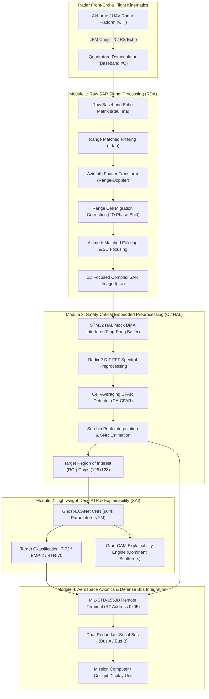
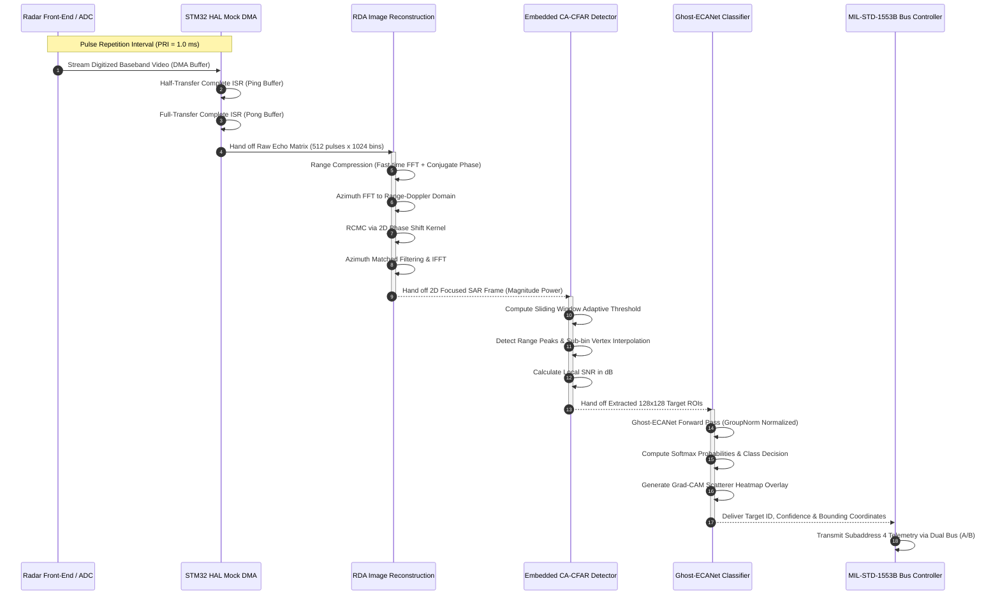

# EdgeSAR System Architecture & Data Flow

**Document ID:** EDGESAR-ARCH-001  
**Version:** 1.0.0  
**Classification:** Defense Avionics Systems Engineering Specification  
**Date:** 2026-09-18  

---

## 1. System Overview

EdgeSAR is an end-to-end embedded radar processing and Automatic Target Recognition (ATR) system spanning:
1. **Module 1: Raw SAR Signal Processing**: Range-Doppler Algorithm (RDA) 2D image reconstruction from first principles.
2. **Module 2: Automatic Target Recognition (ATR)**: Parameter-efficient Ghost-ECANet (< 2M parameters) with Grad-CAM explainability.
3. **Module 3: Embedded Signal Preprocessing**: Host-simulated bare-metal C module (STM32 HAL mock, Radix-2 FFT, CA-CFAR 1D detector) compliant with DO-178C Level B and MISRA-C:2012.
4. **Module 4: Systems Integration**: Dual-redundant MIL-STD-1553B bus scheduling and MIL-STD-882E system safety / FMEA hazard analysis.

---

## 2. End-to-End System Block Diagram

---

## 3. Real-Time Radar Execution & Data Flow Sequence

---

## 4. Architectural Boundaries & Data Structures

| Subsystem | Input Data Format | Output Data Format | Execution Environment | Safety Standard |
|---|---|---|---|---|
| **Module 1 (RDA)** | Complex 2D array `(512, 1024)` float64 | Focused 2D SAR image `(512, 1024)` dB | Python 3.14 (NumPy vectorized) | High-throughput DSP model |
| **Module 2 (ATR)** | Grayscale SAR chip `(1, 128, 128)` float32 | Class ID (`0, 1, 2`) + Conf + Grad-CAM | PyTorch CPU/NPU edge inference | Low-SWaP (< 2M params) |
| **Module 3 (Embedded C)** | Raw unsigned 16-bit DMA buffer | `CFAR_Result_t` static struct | Bare-metal C (Host simulated STM32) | DO-178C DAL-B, MISRA-C:2012 |
| **Module 4 (Avionics)** | Target detection struct + Health metrics | 20-bit Manchester-encoded 1553B words | MIL-STD-1553B serial bus | MIL-STD-1553B, MIL-STD-882E |
